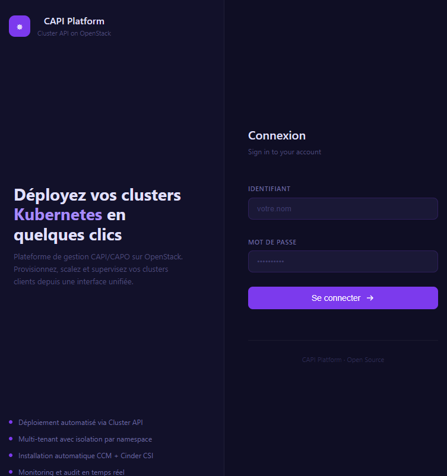
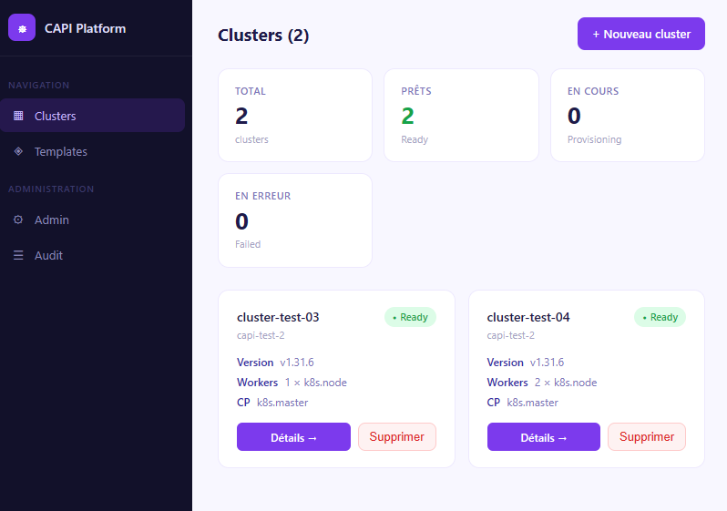
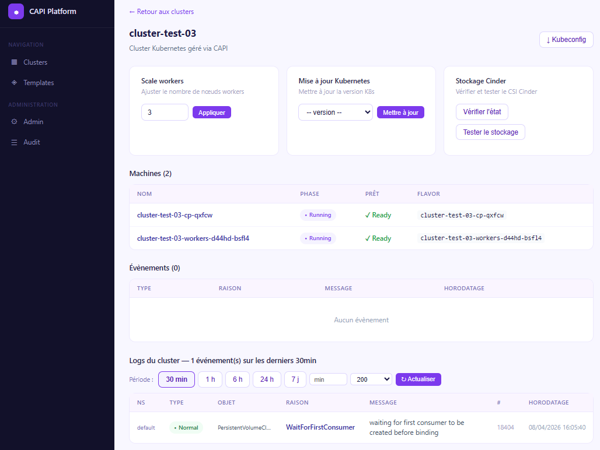

# CAPI Platform UI

I got tired of writing YAML every time I needed to spin up a Kubernetes cluster with CAPI on OpenStack.

One cluster = 7+ manifests. Three clients = do the math. And if you get one `apiVersion` wrong, you spend the next hour debugging a cryptic 422 error.

So I built this.

---

## Screenshots





---

## What it does

A web UI that takes a form input and provisions a full Kubernetes cluster via CAPI/CAPO on OpenStack — no YAML required.

It also handles everything that comes *after* provisioning, which is usually the painful part:

- **Automatic post-install** — Calico CNI, OpenStack CCM and Cinder CSI are deployed automatically once the cluster is up. No manual steps.
- **Live log viewer** — read events and logs directly from the workload cluster without switching contexts
- **Resource explorer** — browse Pods, Deployments, Services and PVCs on any cluster from the UI
- **Scale & upgrade** — change worker count or K8s version without touching kubectl
- **Cinder storage test** — verify your CSI setup with one click
- **Multi-tenancy** — each client gets their own namespace and OpenStack credentials

---

## Who is this for

Anyone who manages CAPI clusters on OpenStack and is tired of copy-pasting YAML.

---

## Stack

- Backend: FastAPI + Jinja2 + PostgreSQL
- Runs in-cluster on the CAPI management cluster (no external kubeconfig needed)
- Targets CAPO v0.10+ / cluster.x-k8s.io v1beta2

---

## Quick start

```bash
git clone https://github.com/GhostSN221/capi-platform-ui.git
cd capi-platform-ui/capi-platform
docker compose up -d

# Create first admin
curl -X POST http://localhost:8000/api/auth/register \
  -H "Content-Type: application/json" \
  -d '{"username":"admin","password":"yourpassword"}'

# Promote to admin
docker compose exec postgres psql -U capi capidb \
  -c "UPDATE users SET is_admin=true WHERE username='admin';"

# Open http://localhost:8000
```

> Mount your kubeconfig for local testing:
> ```yaml
> volumes:
>   - ~/.kube/config:/root/.kube/config:ro
> ```

---

## Kubernetes deployment

```bash
kubectl apply -f k8s/namespace.yaml
kubectl apply -f k8s/rbac.yaml
kubectl apply -f k8s/configmap.yaml
kubectl apply -f k8s/secret.yaml
kubectl apply -f k8s/deployment-postgres.yaml
kubectl apply -f k8s/deployment-redis.yaml
kubectl apply -f k8s/deployment-backend.yaml
kubectl apply -f k8s/services.yaml
```

Edit `k8s/secret.yaml` before applying — change `SECRET_KEY` to something strong.

---

## OpenStack credentials per tenant

```bash
kubectl create namespace my-tenant
kubectl create secret generic my-cloud-cloud-config \
  --from-file=clouds.yaml=./clouds.yaml \
  -n my-tenant
```

Then create the tenant from the Admin page in the UI.

---

## Roadmap

- Vault integration for OpenStack secrets
- OIDC authentication
- Helm chart
- Connect to an existing Kubernetes manager (Rancher, etc.)

---

## Contributing

Issues and PRs are welcome.

---

## License

Apache 2.0


